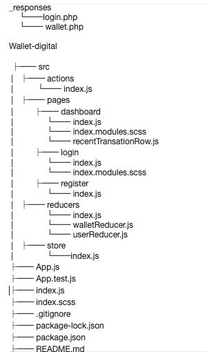

# walletDigital

 Uma empresa no ramo de pagamento quer construir uma carteira digital onde a usabilidade seja fluida e intuitiva para o cliente.  Desenvolveremos os seguintes modulos:  Tela de Cadastro, Tela de Login e Carteira Digital 
 
 ----------------------------- // --------------------------------  
 
  A company in the payment business wants to build a digital wallet where usability is fluid and intuitive for the customer.  We will develop the following modules:  Registration Screen Login screen Digital Wallet

<!--
*** Obrigado por estar vendo o meu README. 
-->

<!-- ABOUT THE PROJECT -->

## Sobre o Projeto

Este projeto visa a criação de uma aplicação em ReactJS ,  me ousei a utilizar essa tecnologia junto ao Redux / Broadcasting o qual ainda não havia trabalhado, visto que seria um ótimo desafio e avanço para o teste. Estava em zona de conforto atuar com JavaScript puro e Angular,  com isso consegui me desafiar e mostrar que não existe algo impossível de aprender, desde que se esforce :).

 OBS: Ao utilizar o broadcasting desenvolvi um button que ao ser clicado reflete a ação do acréscimo de um valor, o qual seria R$ 100,00. Somente para simular.  

Mas da mesma forma acabei não me dedicando tanto ao layout, fiz algo mais simples e funcional voltado a web/tablet e não voltado ao mobile celular (pois aqui teria desenvolvido o componente voltado somente a ele). Foi desenvolvido 3 pages: LOGIN, CADASTRO E WALLET-DIGITAL - Dashboard.

### Feito Com

Abaixo segue tecnologias utilizadas para o desenvolvimento:
  
  - GIT
  - YARN - NPM
  - REACT
  - REDUX
  - NODE
  - JAVASCRIPT
  -JSX
  - Bibliotecas as quais podemos visualizar tanto o uso da qual como a versão no arquivo package.json

<!-- GETTING STARTED -->

## Começando

Para conseguir rodar o projeto, siga os passos abaixo.

### Pré-requisitos

Antes de seguirmos para as configurações e uso do template, é ideal que você tenha o ambiente configurado para testar a aplicação:

  - GIT
  - NODE ( npm, nvm  version  >=  10)
  - XAMP ( rodar arquivos php ) -> manter ativo
  - YARN / NPM 

Apos o clone do projeto e estar na pasta do mesmo, dar yarn install ou npm install, para instalar todas as bibliotecas necessárias e assim conseguir rodar o comando: yarn start para sua aplicação rodar no navegador.

### Estrutura de Arquivos

A estrutura de arquivos está da seguinte maneira:

Serão explicados os arquivos e diretórios:

- **src** - Diretório contendo todos os arquivos da aplicação, é criado um diretório `src` para que o código da aplicação possa ser isolado em um diretório e facilmente portado para outros projetos, se necessário;

  - **pages** - Diretório onde ficam as páginas (telas) da aplicação, como forma de padronização e boas práticas toda página fica dentro de um diretório com seu nome;

      - **index.js** - Arquivo com toda a lógica da página, tal como os componentes visuais a serem renderizados;

  - **index.js** - Arquivo responsável por centralizar o código do diretório `src`, nele são chamadas as rotas tal como qualquer outra configuração que precise ser executada na inicialização da aplicação, ele é como um _Entry Point_ do diretório `src`;

- **package.json** - Esse arquivo tem as dependências, bibliotecas, versões as quais foram utilizadas no projeto.

<!-- CONTRIBUTING -->

## Contribuição

Qualquer contribuição que você fizer será **Bem Vinda :)**.

1. Faça um Fork do projeto
2. Crie uma Branch para sua Feature (`git checkout -b feature/NomeFeature`)
3. Adicione suas mudanças (`git add .`)
4. Comite suas mudanças (`git commit -m 'Adicionando uma Nova Feature!`)
5. Faça o Push da Branch (`git push origin feature/NomeFeature`)
6. Abra um Pull Request

<!-- CONTACT -->

## Contato

Brenda - **marilisebrenda@hotmail.com**
